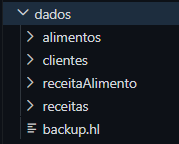
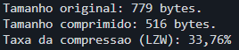
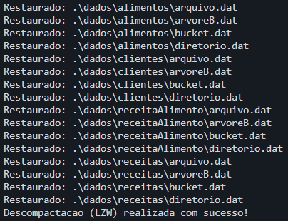
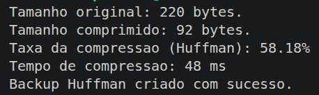

# TP - AEDs III (NutriChef)

Sistema desenvolvido para a disciplina de **Algoritmos e Estruturas de Dados III** da PUC Minas. O NutriChef permite cadastrar e gerenciar clientes, alimentos e receitas, com API REST em Java e interface web.

## Tecnologias
- Java (backend)
- Spark Java (servidor HTTP)
- GSON (JSON)
- HTML, CSS e JavaScript (frontend)

## Estrutura principal
- [src/controller/Servidor.java](src/controller/Servidor.java): endpoints da API
- [src/util/Arquivo.java](src/util/Arquivo.java): persistencia dos registros
- [frontend/index.html](frontend/index.html): entrada do frontend
- [frontend/js/scripts.js](frontend/js/scripts.js): logica da interface
- [frontend/css/style.css](frontend/css/style.css): estilos
- [scripts/seed_data.sh](scripts/seed_data.sh): carga de dados para testes

## Pre-requisitos
- Java 11 ou superior
- Bash
- curl
- Navegador

## Como rodar o projeto

O arquivo `run.sh` já vem junto com o projeto. Basta executar estes passos na raiz do repositório:

1. Dê permissão de execução ao script, uma única vez:

```bash
chmod +x run.sh
```

2. Para iniciar o projeto completo, rode:

```bash
./run.sh
```
O backend sobe em http://localhost:7777 e o frontend abre na porta exibida pelo serve.

## Carga de dados para testes (seed)

O script cria clientes, alimentos e receitas automaticamente via API.

Execução padrão:

````bash
cd /home/.../.../.../TP---AEDs-III
./scripts/seed_data.sh
````

Com quantidades personalizadas:

````bash
./scripts/seed_data.sh http://localhost:7777 100 120 80
````
## Parametros:

URL da API

quantidade de clientes

quantidade de alimentos

quantidade de receitas

## Funcionalidades implementadas

Login

Cadastro de usuario

Recuperacao de senha com codigo (solicitar e confirmar)

Dashboard com visao geral

CRUD de clientes

CRUD de alimentos

CRUD de receitas

Sidebar recolhivel com persistencia de estado

Busca com botao Pesquisar

Busca com filtro de campo:

Clientes: Todos, ID, Nome, E-mail

Alimentos: Todos, ID, Nome, Categoria

Receitas: Todos, ID, Titulo, Tempo

## Endpoints principais

GET /clientes

POST /clientes

PUT /clientes/:id

DELETE /clientes/:id

POST /clientes/login

POST /clientes/esqueci-senha/solicitar

POST /clientes/esqueci-senha/confirmar

GET /alimentos

POST /alimentos

PUT /alimentos/:id

DELETE /alimentos/:id

GET /receitas

POST /receitas

PUT /receitas/:id

DELETE /receitas/:id

## Estrutura do Projeto

TP---AEDs-III/
├── src/
│   ├── controller/
│   │   └── Servidor.java          # API REST
│   ├── dao/
│   │   ├── ClienteDAO.java        # Operações com clientes
│   │   ├── AlimentoDAO.java       # Operações com alimentos
│   │   ├── ReceitaDAO.java        # Operações com receitas
│   │   └── ReceitaAlimentoDAO.java # Relacionamento N:N
│   ├── model/
│   │   ├── Cliente.java           # Entidade Cliente
│   │   ├── Alimento.java          # Entidade Alimento
│   │   ├── Receita.java           # Entidade Receita
│   │   ├── ReceitaAlimento.java   # Entidade Relacionamento
│   │   └── Registro.java          # Interface de serialização
│   ├── service/
│   │   ├── busca/
│   │   │   ├── KMP.java           # Algoritmo KMP
│   │   │   └── BoyerMoore.java    # Algoritmo Boyer-Moore
│   │   ├── BuscaService.java      # Serviço de busca
│   │   └── ...
│   ├── util/
│   │   ├── Arquivo.java           # Persistência genérica
│   │   ├── ArvoreB.java           # Árvore B
│   │   ├── Hash.java              # Hash Extensível
│   │   ├── CriptografiaXOR.java   # Criptografia XOR
│   │   ├── Huffman.java           # Compactação Huffman
│   │   └── LZW.java               # Compactação LZW
│   └── view/
│       ├── Principal.java         # Menu principal
│       ├── MenuCliente.java       # Menu de clientes
│       ├── MenuAlimento.java      # Menu de alimentos
│       ├── MenuReceitas.java      # Menu de receitas
│       └── MenuBusca.java         # Menu de busca KMP/BM
├── frontend/
│   ├── index.html                 # Interface web
│   ├── css/style.css              # Estilos
│   └── js/scripts.js              # Lógica JavaScript
├── dados/                         # Dados persistidos
│   ├── clientes/
│   ├── alimentos/
│   └── receitas/
├── lib/                           # Bibliotecas (JARs)
├── scripts/
│   └── seed_data.sh               # Carga de dados para testes
├── run.sh                         # Script de execução
└── README.md                      # Este arquivo

## Troubleshooting

### erro: no source files
Voce provavelmente usou o padrao errado no find.

Use:

```bash
javac -cp "lib/*" -d out $(find src -name "*.java")
```

Nao use:

```bash
find src -name ".java"
```

### seed_data.sh: comando nao encontrado
Execute com caminho relativo correto a partir da raiz:

```bash
./scripts/seed_data.sh
```

### chmod: nao foi possivel acessar seed_data.sh
O arquivo nao fica na raiz, fica dentro de scripts.

```bash
chmod +x ./scripts/seed_data.sh
./scripts/seed_data.sh
```

### curl: (7) Failed to connect to localhost port 7777
Backend nao esta rodando. Compile e inicie o servidor antes do seed.

## Observacao
Se os dados novos nao aparecerem no navegador, atualize com Ctrl+F5.

## Compactação de arquivos

### LZW

O método de dicionário se localiza na pasta src/util/LZW.java

Assim que os dados das entidades são gravadas na pasta "dados", é necessário realizar a compilação da compactação via terminal. 
(Compilação)
```bash
javac src/util/LZW.java -d src
```
Quando "LZW.class" aparecer no explorer, significa que a compilação foi um sucesso. É possível executar a compactação da pasta dados, que serão armazenadas em um arquivo nomeado "backup.hl" dentro dessa mesma pasta:



#### Execução de Compactação:
```bash
java -cp src util.LZW c
```
Uma mensagem será imprimida no terminal, indicando o tamanho original (em bytes) dos arquivos da pasta de dados gravados, o tamanho do arquivo após a compactação e a taxa em porcentagem de reaproveitamento.



#### Execução da Descompactação:
```bash
java -cp src util.LZW d
```

Será imprimido uma mensagem dos arquivos localizados na pasta dados e logo depois uma mensagem indicando sucesso na descompactação via LZW.



### Huffman

O algoritmo de compactação por Huffman está localizado na pasta src/util/Huffman.java.

Assim que os dados das entidades são gravados na pasta dados, é necessário realizar a compilação da compactação via terminal.

#### Compilação
```bash
javac src/util/Huffman.java -d src
```
Quando o arquivo "Huffman.class" aparecer no explorer, significa que a compilação foi realizada com sucesso. A partir disso, é possível compactar todos os arquivos da pasta dados, gerando um único arquivo de backup chamado "backup.hf".

#### Execução da Compactação
```bash
java -cp src util.Huffman c
```
Ao executar a compactação, o sistema percorre todos os arquivos presentes na pasta dados, calcula as frequências dos bytes, constrói a árvore de Huffman e gera o arquivo "backup.hf".

Uma mensagem será exibida no terminal informando:

- Tamanho original dos dados (em bytes);
- Tamanho do arquivo compactado;
- Taxa de compressão obtida;
- Confirmação da criação do backup.

Exemplo:



#### Execução da Descompactação
```bash
java -cp src util.Huffman d
```
Durante a descompactação, o sistema lê o arquivo "backup.hf", reconstrói a árvore de Huffman a partir das frequências armazenadas e restaura todos os arquivos originais para suas respectivas pastas dentro de dados.

Uma mensagem semelhante à seguinte será exibida:

- Restaurado: ./dados/alimentos/bucket.dat
- Restaurado: ./dados/alimentos/diretorio.dat
- Restaurado: ./dados/receitas/bucket.dat
- Restaurado: ./dados/receitas/diretorio.dat
- Descompactacao Huffman realizada com sucesso!

#### Funcionamento

O algoritmo Huffman realiza a compactação utilizando codificação por frequência. Os bytes mais frequentes recebem códigos menores, enquanto os menos frequentes recebem códigos maiores. Durante a compactação são armazenadas as frequências dos símbolos, permitindo que a árvore de Huffman seja reconstruída posteriormente para a descompactação.

O resultado é um único arquivo de backup (backup.hf) contendo todos os arquivos utilizados pelo sistema.

## Casamento de Padrões

### KMP (Knuth-Morris-Pratt)

O algoritmo KMP está localizado na pasta src/service/busca/KMP.java, e é utilizado através da classe orquestradora src/service/BuscaService.java. A interação é feita a partir da opção do menu do Principal.java "4 - Pesquisar por padrão (KMP / BM)". É preferível que essa opção seja escolhida após a gravação de dados das entidades envolvidas.

O KMP permite buscar um padrão (substring) dentro dos seguintes campos textuais do sistema:
- Nome do Cliente
- Nome do Alimento
- Título da Receita
  
A busca não exige correspondência exata — basta que o padrão informado esteja contido no texto do campo (busca case-insensitive). Por exemplo, buscar por "ana" encontra um cliente chamado "Ana" ou "Mariana".

### Compilação
```bash
javac service/busca/KMP.java service/BuscaService.java -d .
```
Execute o comando acima a partir da pasta `src`. Quando os arquivos `KMP.class` e `BuscaService.class` aparecerem no explorer, a compilação foi concluída com sucesso.

#### Execução via menu do sistema 
O KMP está integrado diretamente ao menu principal do sistema (console). Para utilizá-lo:
 
1. Compile e execute o `Principal.java` normalmente:
```bash
javac view/*.java service/busca/*.java service/*.java dao/*.java model/*.java util/*.java -d .
java view.Principal
```
 
2. No menu principal, escolha a opção:
```
4 - Pesquisar por padrão (KMP / BM)
```
 
3. Escolha qual entidade deseja buscar (Cliente, Alimento ou Receita).
   
4. Escolha o algoritmo:
```
1 - KMP (Knuth-Morris-Pratt)
2 - Boyer-Moore
```
Digite `1` para utilizar o KMP.
 
5. Digite o padrão (texto) que deseja buscar. O sistema vai retornar todos os registros cujo campo correspondente contém esse padrão.
Exemplo de uso buscando por clientes cujo nome contenha "ana":
```
Digite o padrão a buscar no nome do cliente: ana
 
--- Resultado da busca (KMP) ---
Cliente {id = 1; Nome = ana; Data de Nascimento = ...}
Cliente {id = 3; Nome = mariana; Data de Nascimento = ...}
 
Total: 2 cliente(s) encontrado(s).
```
 
#### Funcionamento
O KMP evita comparações redundantes ao construir, a partir do próprio padrão buscado, uma **tabela de falha** (função de prefixo). Essa tabela indica, para cada posição do padrão, qual o maior prefixo que também é sufixo até aquele ponto.
 
Durante a busca, ao encontrar um caractere que não corresponde (mismatch), o algoritmo usa essa tabela para "pular" diretamente para a próxima posição válida no padrão, sem precisar retroceder no texto. Isso garante complexidade O(n + m), onde `n` é o tamanho do texto e `m` é o tamanho do padrão — evitando o reprocessamento típico de uma busca ingênua.

### Boyer-Moore

O algoritmo Boyer-Moore está localizado na pasta `src/service/busca/BoyerMoore.java`, e é utilizado através da classe orquestradora `src/service/BuscaService.java`. A interação é feita a partir da opção do menu do `Principal.java` **"4 - Pesquisar por padrão (KMP / BM)"**. É preferível que essa opção seja escolhida após a gravação de dados das entidades envolvidas.

O Boyer-Moore permite buscar um padrão (substring) dentro dos seguintes campos textuais do sistema:

* Nome do Cliente
* Nome do Alimento
* Título da Receita

A busca não exige correspondência exata — basta que o padrão informado esteja contido no texto do campo (busca case-insensitive). Por exemplo, buscar por "ana" encontra um cliente chamado "Ana" ou "Mariana".

### Compilação

```bash
javac service/busca/BoyerMoore.java service/BuscaService.java -d .
```

Execute o comando acima a partir da pasta `src`. Quando os arquivos `BoyerMoore.class` e `BuscaService.class` aparecerem no explorer, a compilação foi concluída com sucesso.

#### Execução via menu do sistema

O Boyer-Moore está integrado diretamente ao menu principal do sistema (console). Para utilizá-lo:

1. Compile e execute o `Principal.java` normalmente:

```bash
javac view/*.java service/busca/*.java service/*.java dao/*.java model/*.java util/*.java -d .
java view.Principal
```

2. No menu principal, escolha a opção:

```
4 - Pesquisar por padrão (KMP / BM)
```

3. Escolha qual entidade deseja buscar (Cliente, Alimento ou Receita).

4. Escolha o algoritmo:

```
1 - KMP (Knuth-Morris-Pratt)
2 - Boyer-Moore
```

Digite `2` para utilizar o Boyer-Moore.

5. Digite o padrão (texto) que deseja buscar. O sistema vai retornar todos os registros cujo campo correspondente contém esse padrão.

Exemplo de uso buscando por clientes cujo nome contenha "ana":

```
Digite o padrão a buscar no nome do cliente: ana

--- Resultado da busca (BM) ---
Cliente {id = 1; Nome = ana; Data de Nascimento = ...}
Cliente {id = 3; Nome = mariana; Data de Nascimento = ...}

Total: 2 cliente(s) encontrado(s).
```

#### Funcionamento

O Boyer-Moore realiza as comparações do padrão com o texto da direita para a esquerda. Antes da busca, o algoritmo constrói uma **tabela de última ocorrência** (heurística *Bad Character*), que registra a posição mais à direita de cada caractere presente no padrão.

Durante a busca, quando ocorre uma divergência entre o padrão e o texto, essa tabela é utilizada para determinar quantas posições o padrão pode ser deslocado. Em vez de avançar apenas uma posição por vez, o algoritmo frequentemente realiza saltos maiores, reduzindo significativamente o número de comparações necessárias.

Na implementação desenvolvida foi utilizada a heurística **Bad Character**, suficiente para localizar ocorrências do padrão de forma eficiente. Embora a complexidade no pior caso seja O(n·m), o desempenho médio é geralmente superior ao da busca ingênua, especialmente em textos longos e padrões maiores.

### Criptografia
## XOR Encryption
A criptografia XOR é utilizada para proteger as senhas dos clientes.

Como funciona:
A senha é convertida para bytes
Cada byte é combinado com a chave usando XOR
O resultado é codificado em Base64 para armazenamento
Para descriptografar, o processo é invertido
Chave utilizada: "NutriChef2024SecureKey"

### Criptografar
String senhaCriptografada = CriptografiaXOR.criptografar("minhaSenha123");

### Descriptografar
String senhaOriginal = CriptografiaXOR.descriptografar(senhaCriptografada);

## 🔧 Compilação e Execução

### Compilar o Projeto

```bash

javac -cp "lib/*" -d out $(find src -name "*.java")

java -cp "out:lib/*" view.Principal

```

Cadastre um cliente:

1. Vá em Clientes → Incluir Cliente

2. Informe os dados e uma senha (ex: minhaSenha123)

3. O sistema criptografa a senha automaticamente

4. Verifique o arquivo de dados:

5. Abra o arquivo ./dados/clientes/arquivo.dat

A senha estará criptografada em formato Base64

Exemplo: TWlu...YW55 (não é legível)